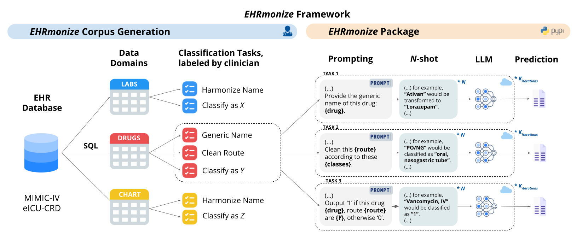

# EHRmonize

Welcome to `ehrmonize`, a Python package to abstract medical concepts using large language models.

## Citation

TBD

> As a data scientist working with EHR data, I want to be able to automatically categorize medical concepts, so that I can collaborate more efficiently with clinicians.

## Rationale

Corpus generation from EHRs provides the
data that needs categorization, across different domains and tasks, which is then fed to `ehrmonize` to employs LLMs to categorize the entries into predefined classes.

## Current supported tasks

| Type          | Task                          |
|---------------|-------------------------------|
| Free-text     | *get_generic_name*            |
|               | *get_generic_route*           |
| Multiclass    | *classify_drug*               |
| Binary        | *one_hot_drug_classification* |
| Custom        | *custom*                      |

## Current supported models / engines / APIs

| API           | model_id                              |
|---------------|---------------------------------------|
| OpenAI        | gpt-3.5-turbo                         |
|               | gpt-4                                 |
|               | gpt-4o                                |
| AWS Bedrock   | anthropic.claude-instant-v1           |
|               | meta.llama3-70b-instruct-v1:0         |
|               | mistral.mixtral-8x7b-instruct-v0:1    |
